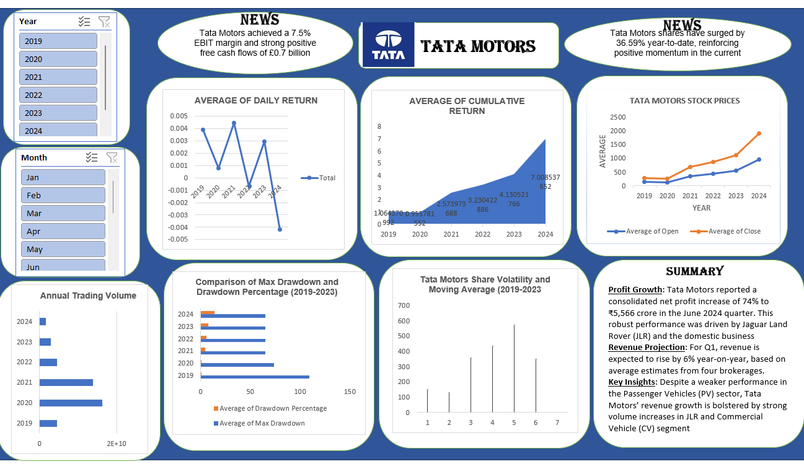

# 📊 Tata Motors Stock Dashboard

## 📌 Overview
Interactive **Excel dashboard** analyzing **Tata Motors (2019–2024)**:  
returns, stock prices, volatility, trading volume, and key financial highlights.
This project helps investors and analysts explore stock performance trends of Tata Motors in a simple and interactive way.

## 🚀 Features
- **Filters:** Year (2019–2024), Month (Jan–Jun)
- **Visuals:**  
  - Average Daily Return  
  - Cumulative Return  
  - Avg Open vs Close Stock Prices  
  - Annual Trading Volume  
  - Max Drawdown & % (2019–2023)  
  - Volatility & Moving Average  
- **News & Summary:**  
  EBIT margin 7.5%, £0.7B FCF, YTD +36.59%, Profit +74% (₹5,566 Cr)

## 📂 Files
- `Tata_Motors_Dashboard.xlsx` – Excel dashboard  
- `dashboard.png` – preview image  
- `README.md` – documentation  

## ⚡ How to Use
1. Download `Tata_Motors_Dashboard.xlsx`.  
2. Open in Excel (enable content if prompted).  
3. Use **Year/Month** slicers to explore KPIs and charts.  

## 🧠 Key Insights
- 📈 Cumulative returns steadily increased (2019–2024).  
- 💰 Closing prices stayed higher than opening → strong momentum.  
- 📉 Drawdown & volatility show risk exposure.  
- 🚗 Growth mainly driven by Jaguar Land Rover (JLR) & Commercial Vehicles.  

## 🛠️ Built With
- Microsoft Excel (Pivot Tables, Charts, Slicers)  
- Custom formatting & KPIs
  

## 🗂️ Repo Structure
📁 Tata-Motors-Dashboard
├── README.md
├── Tata_Motors_Dashboard.xlsx
└── dashboard.png
The repo contains the Excel dashboard, a preview image, and project documentation.

